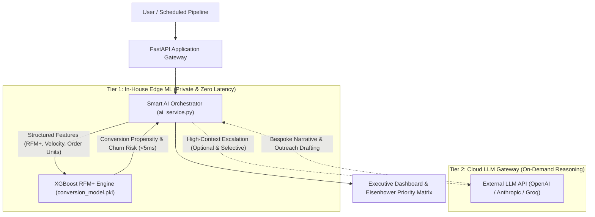

# ClientTracker

<div align="center">

[](https://www.python.org/)
[](https://fastapi.tiangolo.com/)
[](https://xgboost.readthedocs.io/)
[](https://www.mongodb.com/)
[](#hybrid-ai-architecture)
[](LICENSE)

**Predictive B2B CRM & Execution Engine driven by In-House Machine Learning and Hybrid AI Orchestration.**

[English](README.md) • [Português (Brasil)](README.pt-BR.md)

[Key Capabilities](#key-capabilities) • [Hybrid AI Architecture](#hybrid-ai-architecture) • [In-House ML Model](#in-house-ml-model--training) • [Tech Stack](#tech-stack) • [Quickstart](#getting-started) • [License](#license)

</div>

---

## Overview

**ClientTracker** is a high-performance customer intelligence and pipeline execution system. Built for modern sales organizations and professional service firms, it replaces manual CRM routines with a **15-minute weekly review methodology**, backed by an **in-house trained XGBoost classification engine** and an **adaptive Cloud LLM gateway**.

Rather than relying on continuous, costly external API roundtrips for every client calculation, ClientTracker operates on an **asymmetric hybrid architecture**:
1. **In-House Edge Model (On-Premise / Local)**: Evaluates conversion propensity, churn risk, and RFM+ scores in **under 5 milliseconds** with **zero token cost** and **100% data confidentiality**.
2. **On-Demand Cloud LLM Gateway (API)**: Selectively engaged only when unstructured qualitative reasoning or bespoke executive narrative drafting is required.

---

## Hybrid AI Architecture



### Architectural Benchmark: Edge ML vs. Pure Cloud LLM

| Dimension | Pure Cloud LLM Approach | In-House Trained Local Model | ClientTracker Hybrid Strategy |
| :--- | :--- | :--- | :--- |
| **Inference Latency** | 800ms – 3,500ms (Network + Generation) | **< 5ms (In-Memory Inference)** | **Instantaneous UI rendering (<5ms)** |
| **Data Privacy & Compliance** | Confidential CRM data crosses external APIs | **100% Air-Gapped / On-Premise Execution** | **Strict GDPR / LGPD Compliance** |
| **Operational Expense (OPEX)** | Linear increase with client and query count | **Zero incremental cost per prediction** | **~90% API Cost Reduction** |
| **Availability / Offline Mode** | Dependent on external API uptime & rate limits | **Always available locally** | **Resilient with graceful local fallbacks** |
| **Functional Specialization** | Creative synthesis & text drafting | Accurate probabilistic scoring & regression | **Optimized division of labor** |

---

## In-House ML Model & Training

The predictive conversion backbone was trained on the industry-standard **Online Retail II dataset (UCI Machine Learning Repository)**, encompassing hundreds of thousands of real transactional records.

```
       Online Retail II Benchmark
     (UCI Machine Learning Repository)
                   │
                   ▼
  ┌─────────────────────────────────┐
  │     Data Hygiene & Cleaning     │
  │ • Quantity & Price validation   │
  │ • Customer ID normalization     │
  └────────────────┬────────────────┘
                   │
                   ▼
  ┌─────────────────────────────────┐
  │   Feature Engineering (RFM+)    │
  │ • Recency (decay dynamics)      │
  │ • Frequency (unique invoices)   │
  │ • Monetary Value (total revenue)│
  │ • Products per Basket           │
  │ • Sales Velocity (purchase gap) │
  │ • Geographic One-Hot Encoding   │
  └────────────────┬────────────────┘
                   │
                   ▼
  ┌─────────────────────────────────┐
  │   XGBoost Binary Classifier     │
  │   objective='binary:logistic'   │
  │   eval_metric='auc'             │
  │   max_depth=5, learning_rate=0.1│
  └────────────────┬────────────────┘
                   │
                   ▼
  ┌─────────────────────────────────┐
  │   Serialized Production Model   │
  │   (ml/models/conversion_model)  │
  └─────────────────────────────────┘
```

### Extended Features (RFM+)
* **Recency ($R$):** Days elapsed since the most recent client transaction.
* **Frequency ($F$):** Distinct transaction count and interaction density over rolling periods.
* **Monetary Value ($M$):** Lifetime cumulative revenue.
* **Average Units per Order:** Volume density per transaction.
* **Sales Velocity:** Purchase frequency normalized over customer lifecycle span:
  $$\text{Sales Velocity} = \frac{\Delta \text{Days}(\text{Latest} - \text{First})}{\max(\text{Frequency}, 1)}$$
* **Conversion Target:** Supervised binary classification indicating multi-cycle repeat purchasing and client retention probability.

### Reproducibility & Model Training
The entire pipeline is packaged in the repository:
```bash
# Execute end-to-end training and artifact serialization
python ml/train_conversion_model.py
```

---

## Key Capabilities

- **RFM+ Predictive Scoring:** Automatic tiering into High, Medium, and At-Risk segments with calculated conversion probabilities.
- **Eisenhower Priority Matrix:** Dynamic classification of pipeline tasks into:
  - *Urgent & Important (Do First)*
  - *Important & Not Urgent (Schedule)*
  - *Urgent & Not Important (Delegate / Automate)*
  - *Neither Urgent Nor Important (Eliminate)*
- **Interactive Kanban Board:** Drag-and-drop workflow inspired by modern kanban systems.
- **Bi-Directional Calendar Sync:** Google Calendar integration for automated scheduling of prioritized client contacts.
- **Automated Contact Scheduling:** Background scheduler (APScheduler) alerting account executives when high-value accounts enter critical recency windows.
- **Email Notification Dispatch:** Granular notification triggers via SMTP.

---

## Tech Stack

- **Backend Framework:** FastAPI (Python 3.10+) with asynchronous routing.
- **Database & ODM:** MongoDB with Motor (Async driver) and PyMongo.
- **Machine Learning & Analytics:** XGBoost, Scikit-Learn, Pandas, NumPy, Joblib.
- **LLM Orchestration:** Custom HTTPX async client compatible with OpenAI, Groq, Anthropic, or local Ollama endpoints.
- **Task Scheduling:** APScheduler for periodic cadence evaluation.
- **Security & Auth:** JWT tokens (python-jose), bcrypt password hashing, session management.
- **Frontend / Presentation:** Jinja2 server-rendered templates styled with TailwindCSS and responsive JS.

---

## Project Structure

```
clienttracker/
├── app/
│   ├── api/routes/         # FastAPI endpoints (auth, clients, tasks, calendar)
│   ├── core/               # Configuration, security, async database connectors
│   ├── jobs/               # Background scheduled jobs (APScheduler)
│   ├── models/             # Pydantic domain schemas and MongoDB models
│   ├── services/           # Business logic, RFM metrics, and Hybrid AI Service
│   ├── static/             # CSS styling, JavaScript modules, assets
│   └── templates/          # Jinja2 responsive views (Matrix, Dashboard, Landing)
├── ml/
│   ├── models/             # Compiled model artifacts (.pkl)
│   ├── inference.py        # Sub-5ms in-memory inference engine
│   └── train_conversion_model.py  # End-to-end UCI dataset training pipeline
├── scripts/                # Database migrations and operational utilities
├── .env.example            # Sanitized environment configuration template
├── LICENSE                 # PolyForm Noncommercial License 1.0.0
├── requirements.txt        # Pinned runtime and development dependencies
└── README.md               # Architecture documentation and quickstart
```

---

## Getting Started

### 1. Prerequisites
- Python 3.10+
- MongoDB 5.0+ (Local instance or MongoDB Atlas)

### 2. Clone and Setup Environment
```bash
git clone <repository-url>
cd clienttracker

python -m venv venv
# Linux / macOS:
source venv/bin/activate
# Windows (PowerShell):
.\venv\Scripts\Activate.ps1
```

### 3. Install Dependencies
```bash
pip install -r requirements.txt
```

### 4. Configure Environment Variables
Copy the sanitized template:
```bash
cp .env.example .env
```
Update `.env` with your local MongoDB connection string:
```env
MONGODB_URL="mongodb://localhost:27017/clienttracker"
SECRET_KEY="generate_a_random_32_byte_hex_string"
ENVIRONMENT="development"

# Optional Cloud LLM API key (used for Tier-2 reasoning)
LLM_API_KEY="sk-..."
```

### 5. Compile the Local Predictive Model (Optional)
To train and compile the latest XGBoost model artifact locally:
```bash
python ml/train_conversion_model.py
```
*(If no `.pkl` artifact is compiled yet, the inference engine automatically activates its high-performance heuristic scoring baseline).*

### 6. Run the Application
```bash
uvicorn app.main:app --host 0.0.0.0 --port 8000 --reload
```
Access the application dashboard at `http://localhost:8000`.

---

## License

This project is licensed under the **PolyForm Noncommercial License 1.0.0**.

- **Permitted:** Free for personal use, inspection, research, educational testing, and evaluation.
- **Prohibited:** Selling, licensing, monetizing, or commercial distribution of this software or any derivatives thereof, in whole or in part.

See the complete terms in [LICENSE](LICENSE).