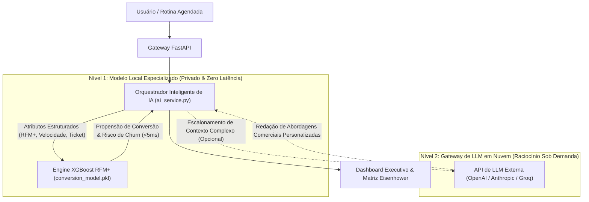

# ClientTracker

<div align="center">

[](https://www.python.org/)
[](https://fastapi.tiangolo.com/)
[](https://xgboost.readthedocs.io/)
[](https://www.mongodb.com/)
[](#arquitetura-híbrida-de-ia)
[](LICENSE)

**CRM Preditivo B2B & Motor de Execução orientado por Machine Learning Próprio e Orquestração Híbrida de IA.**

[English](README.md) • [Português (Brasil)](README.pt-BR.md)

[Recursos Principais](#recursos-principais) • [Arquitetura Híbrida de IA](#arquitetura-híbrida-de-ia) • [Modelo de ML Próprio](#modelo-de-ml-próprio--treinamento) • [Stack Tecnológica](#stack-tecnológica) • [Instalação](#primeiros-passos) • [Licença](#licença)

</div>

---

## Visão Geral

O **ClientTracker** é uma plataforma de inteligência de clientes e gestão de pipeline de alta performance. Desenvolvido para equipes comerciais modernas e consultorias profissionais, substitui rotinas burocráticas de CRM por uma **metodologia de revisão semanal de 15 minutos**, impulsionada por um **modelo preditivo próprio treinado em XGBoost** e um **gateway adaptativo para LLMs em nuvem**.

Em vez de depender de requisições externas lentas e caras para cada cálculo de cliente, o ClientTracker opera em uma **arquitetura híbrida assimétrica**:
1. **Modelo Local Especializado (Edge / On-Premise)**: Calcula propensão de conversão, risco de churn e scores RFM+ estendidos em **menos de 5 milissegundos**, com **zero custo de tokens de API** e **100% de confidencialidade dos dados**.
2. **Gateway de LLM em Nuvem Sob Demanda (API)**: Acionado seletivamente apenas quando tarefas qualitativas e de raciocínio aberto são necessárias (ex: redação executiva de propostas, resumos semânticos e abordagens de vendas personalizadas).

---

## Arquitetura Híbrida de IA



### Comparativo Arquitetural: Modelo Local vs. LLM em Nuvem Pura

| Dimensão | Abordagem Apenas com LLM em Nuvem | Modelo Local Especializado (In-House) | Estratégia Híbrida do ClientTracker |
| :--- | :--- | :--- | :--- |
| **Latência de Inferência** | 800ms a 3.500ms (Rede + Geração de Tokens) | **< 5ms (Inferência em Memória)** | **Renderização instantânea na interface (<5ms)** |
| **Privacidade de Dados (LGPD/GDPR)** | Dados financeiros e confidenciais trafegam para terceiros | **100% On-Premise / Servidor Local** | **Conformidade estrita: dados sensíveis nunca saem** |
| **Custo Operacional (OPEX)** | Aumenta linearmente com o número de clientes e consultas | **Custo zero por predição** | **Redução de ~90% nos custos de API** |
| **Disponibilidade / Modo Offline** | Sujeito a instabilidades de rede e limites de taxa (rate limits) | **Sempre disponível localmente** | **Resiliente com fallback heurístico gracioso** |
| **Especialização Funcional** | Síntese de texto livre e redação criativa | Alta precisão em scoring probabilístico e regressão | **Divisão ótima de trabalho por competência** |

---

## Modelo de ML Próprio & Treinamento

O motor preditivo foi treinado sobre o benchmark **Online Retail II (UCI Machine Learning Repository)**, englobando centenas de milhares de transações comerciais reais.

```
       Benchmark Online Retail II
     (UCI Machine Learning Repository)
                   │
                   ▼
  ┌─────────────────────────────────┐
  │      Higienização dos Dados     │
  │ • Validação de Quantidade/Preço │
  │ • Normalização de Customer IDs  │
  └────────────────┬────────────────┘
                   │
                   ▼
  ┌─────────────────────────────────┐
  │   Engenharia de Atributos (RFM+)│
  │ • Recência (curva de decaimento)│
  │ • Frequência (pedidos únicos)   │
  │ • Valor Monetário (LTV acumulado│
  │ • Média de Produtos por Compra  │
  │ • Sales Velocity (velocidade)   │
  │ • One-Hot Encoding de Países    │
  └────────────────┬────────────────┘
                   │
                   ▼
  ┌─────────────────────────────────┐
  │  Classificador Binário XGBoost  │
  │   objective='binary:logistic'   │
  │   eval_metric='auc'             │
  │   max_depth=5, learning_rate=0.1│
  └────────────────┬────────────────┘
                   │
                   ▼
  ┌─────────────────────────────────┐
  │  Artefato de Produção Serializado│
  │   (ml/models/conversion_model)  │
  └─────────────────────────────────┘
```

### Features Estendidas (RFM+)
* **Recência ($R$):** Dias decorridos desde a transação mais recente do cliente.
* **Frequência ($F$):** Contagem de compras e densidade de interações ao longo do tempo.
* **Valor Monetário ($M$):** Faturamento total gerado ao longo do ciclo de vida.
* **Média de Produtos por Pedido:** Volume médio de itens por cesta de compras.
* **Sales Velocity (Velocidade de Vendas):** Espaçamento médio entre transações:
  $$\text{Sales Velocity} = \frac{\Delta \text{Dias}(\text{Última Compra} - \text{Primeira Compra})}{\max(\text{Frequência}, 1)}$$
* **Variável Target:** Classificação supervisionada indicando propensão a compras recorrentes e retenção de longo prazo.

### Reprodutibilidade do Treinamento
O pipeline completo de treinamento está contido no repositório:
```bash
# Executa o pipeline de treino ponta a ponta e serializa o artefato
python ml/train_conversion_model.py
```

---

## Recursos Principais

- **Score Preditivo RFM+:** Segmentação automática em carteiras de Alto Potencial, Médio e Risco com probabilidade calculada de conversão.
- **Matriz de Prioridades Eisenhower:** Organização dinâmica de tarefas em quatro quadrantes de decisão:
  - *Urgente & Importante (Fazer Agora)*
  - *Importante & Não Urgente (Agendar)*
  - *Urgente & Não Importante (Delegar / Automatizar)*
  - *Nem Urgente Nem Importante (Eliminar)*
- **Kanban Interativo:** Interface moderna drag-and-drop para fluxo contínuo de trabalho.
- **Sincronização com Google Calendar:** Integração bidirecional para agendamento automático de follow-ups prioritários.
- **Agendador em Segundo Plano:** Serviço assíncrono (APScheduler) que alerta executivos quando clientes estratégicos entram em janelas críticas de inatividade.
- **Disparo de Notificações:** Sistema configurável de lembretes e alertas via SMTP.

---

## Stack Tecnológica

- **Backend:** FastAPI (Python 3.10+) com rotas assíncronas de alta performance.
- **Banco de Dados:** MongoDB com driver assíncrono Motor e PyMongo.
- **Machine Learning & Ciência de Dados:** XGBoost, Scikit-Learn, Pandas, NumPy, Joblib.
- **Orquestração de LLMs:** Cliente assíncrono HTTPX flexível para integração com OpenAI, Groq, Anthropic ou Ollama local.
- **Agendamento de Tarefas:** APScheduler para execução periódica de rotinas de contato.
- **Segurança & Autenticação:** Tokens JWT (python-jose), criptografia bcrypt e controle de sessões.
- **Frontend / Interface:** Templates Jinja2 renderizados no servidor com TailwindCSS e componentes interativos.

---

## Estrutura do Projeto

```
clienttracker/
├── app/
│   ├── api/routes/         # Endpoints FastAPI (auth, clientes, tarefas, calendário)
│   ├── core/               # Configurações centrais, segurança e conexão MongoDB
│   ├── jobs/               # Rotinas assíncronas em segundo plano (APScheduler)
│   ├── models/             # Schemas Pydantic e modelos MongoDB
│   ├── services/           # Lógica de negócio, métricas RFM e Serviço de IA Híbrida
│   ├── static/             # Folhas de estilo CSS, scripts JS e assets
│   └── templates/          # Visualizações Jinja2 (Matriz, Dashboard, Landing Page)
├── ml/
│   ├── models/             # Artefatos compilados de modelo (.pkl)
│   ├── inference.py        # Motor de inferência em memória (<5ms)
│   └── train_conversion_model.py  # Pipeline completo de treino do dataset UCI
├── scripts/                # Scripts de migração de banco e utilitários operacionais
├── .env.example            # Modelo sanitizado de variáveis de ambiente
├── LICENSE                 # Termos da PolyForm Noncommercial License 1.0.0
├── requirements.txt        # Dependências pinadas da aplicação e de ML
├── README.md               # Documentação principal em Inglês
└── README.pt-BR.md         # Documentação em Português
```

---

## Primeiros Passos

### 1. Pré-requisitos
- Python 3.10+
- MongoDB 5.0+ (Instância local ou MongoDB Atlas)

### 2. Clonar e Configurar o Ambiente
```bash
git clone https://github.com/jota-f/ClientTracker.git
cd ClientTracker

python -m venv venv
# Linux / macOS:
source venv/bin/activate
# Windows (PowerShell):
.\venv\Scripts\Activate.ps1
```

### 3. Instalar Dependências
```bash
pip install -r requirements.txt
```

### 4. Configurar Variáveis de Ambiente
Copie o arquivo de exemplo:
```bash
cp .env.example .env
```
Atualize o arquivo `.env` com a sua string de conexão MongoDB:
```env
MONGODB_URL="mongodb://localhost:27017/clienttracker"
SECRET_KEY="sua_chave_secreta_aleatoria"
ENVIRONMENT="development"

# Opcional: Chave de API para raciocínio qualitativo via LLM em Nuvem
LLM_API_KEY="sk-..."
```

### 5. Compilar o Modelo Preditivo Local (Opcional)
Para treinar e compilar o classificador XGBoost localmente:
```bash
python ml/train_conversion_model.py
```
*(Caso o arquivo `.pkl` ainda não esteja compilado, a aplicação utilizará automaticamente sua heurística preditiva de alta performance).*

### 6. Executar a Aplicação
```bash
uvicorn app.main:app --host 0.0.0.0 --port 8000 --reload
```
Acesse o painel da aplicação em `http://localhost:8000`.

---

## Licença

Este projeto está licenciado sob a **PolyForm Noncommercial License 1.0.0**.

- **Permitido:** Uso livre para fins pessoais, inspeção de código, pesquisa, testes educacionais e avaliação.
- **Proibido:** Venda, licenciamento, cobrança de taxas de acesso ou distribuição comercial deste software ou de seus derivados, no todo ou em partes.

Consulte os termos completos em [LICENSE](LICENSE).
